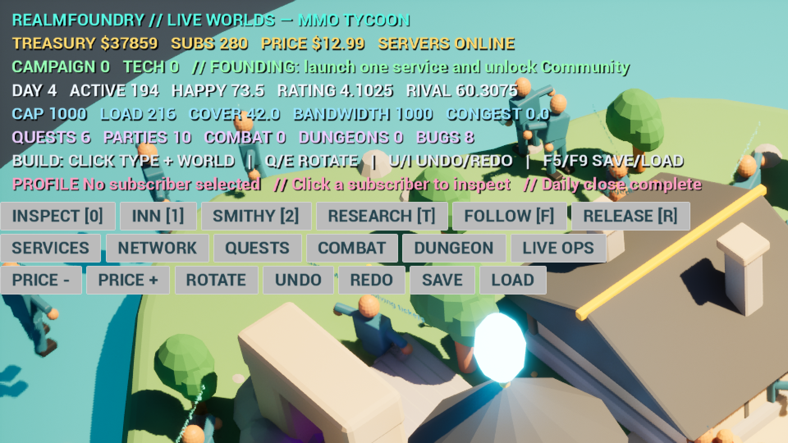

# RealmFoundry: Live Worlds

RealmFoundry is an original 3D, top-down MMORPG management simulator built in Unreal Engine 5. You operate a living fantasy service from a strategy camera: research technology, tune pricing, watch visible subscribers, expand capacity, place services, manage daily cash flow, inspect inhabitants, and publish updates.

The `v0.4.0` Living Worlds release includes a 36-character visible population representing 10,000 logical subscribers, four named visible staff, timed/costed technology research, prerequisite-gated construction, rotation and undo/redo, a four-stage campaign, live-service operations, daily economy/capacity/growth simulation, pricing controls, and disk-backed construction-aware save/load.

[Download the playable Windows release](https://github.com/Eipckz/realmfoundry-live-worlds/releases/tag/v0.4.0).

See [GAME_CONTRACT.md](GAME_CONTRACT.md) for the frozen product contract, [FEATURE_MATRIX.md](FEATURE_MATRIX.md) for implementation depth, [ASSET_MANIFEST.md](ASSET_MANIFEST.md) for asset provenance, and [TEST_LEDGER.md](TEST_LEDGER.md) for reproducible verification.

## Play the management loop

1. Use `W`, `A`, `S`, and `D` to pan the top-down camera.
2. Press `T` to research the next technology tier. Press `1` through `6` to select an Inn, Smithy, Uplink, Guild Hall, Dungeon Gate, or Travel Dock; locked categories reject placement until their prerequisite tier completes.
3. Left-click the world to place the selected service on the 250 cm construction grid.
4. Watch treasury, price, subscribers, active players, happiness, revenue, profit, capacity, load, and research update in the live HUD.
5. After all six service categories have been established, press `R` to publish the major update.

Additional controls: `0` enters subscriber inspection mode, `F` follows the selected subscriber, `Esc` returns to strategy view, `Q`/`E` rotate construction, `U`/`I` (or `Z`/`Y`) undo/redo, `-`/`+` change subscription price, `F5` saves, and `F9` loads. Nineteen HUD buttons expose build, operations, pricing, history, save, and load actions by mouse.

Each building costs `$2,500`, adds `400` subscribers and `7` hype, and contributes one changelog item. The major release adds `$15,000`, `4,000` subscribers, `25` hype, and advances the simulation by 30 days.

## Original 3D art

The primary town is a 523-object Blender scene with 22 authored materials, layered terrain, water, roads, bridges, trees, walls, market details, and fantasy service buildings. Six gameplay buildings are also exported as origin-centered modular assets for runtime placement. The authoritative source is `ExternalAssets/DioramaV2/RF_DioramaV2.blend`; the scene-generation and export scripts are stored beside the project.

The legacy master library remains in the repository as supplementary simulation content for classes, subscribers, monsters, weapons, dungeon props, and themed service data. It is not the presentation layer used by the corrected tycoon release.

## Run or rebuild

Windows players can download the ZIP from the `v0.4.0` GitHub Release, extract it, and launch `RealmFoundry.exe`. Windows SmartScreen may ask for confirmation because this independent build is not code-signed.

To work from source, open `RealmFoundry.uproject` in Unreal Engine 5.8.1. The project uses Epic's Model Context Protocol plugin and a Blueprint-only runtime architecture.

Useful scripts:

- `Tools/Launch-RealmFoundry-Editor.cmd` opens the project in the configured engine.
- `Tools/Package-RealmFoundry-Windows.cmd` performs the reproducible Windows Shipping cook, IoStore package, prerequisites stage, and archive.
- `ExternalAssets/Scripts/generate_realmfoundry_diorama_v2.py` regenerates the Blender town.
- `ExternalAssets/Scripts/export_realmfoundry_buildings_v2.py` exports the six modular gameplay buildings.
- `Design/Programmatic/compile_tycoon_blueprints.py` compiles all corrected gameplay Blueprints with warnings treated as errors.

## Release status

`v0.4.0` passed warnings-as-errors Blueprint validation, PIE construction/save tests, a 568-package Shipping cook with zero errors, 1920×1080 packaged launch and presentation checks, packaged construction input, packaged save creation, normal process exit, archive structure inspection, and SHA-256 hashing. See `TEST_LEDGER.md` for exact evidence and `FEATURE_MATRIX.md` for the honest implementation-depth inventory.
