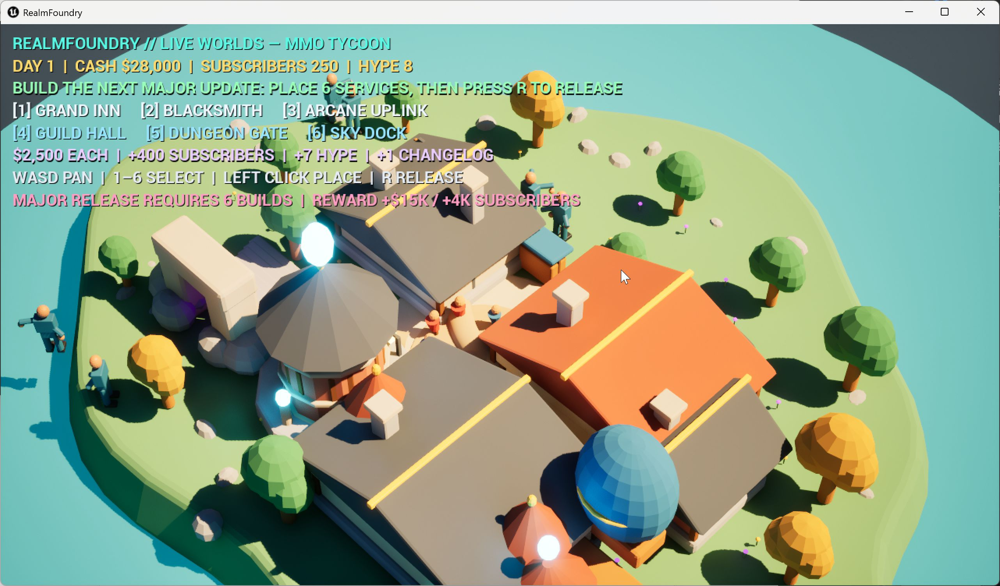

# RealmFoundry: Live Worlds

RealmFoundry is an original 3D, top-down MMORPG tycoon built in Unreal Engine 5. You run a simulated live-service fantasy world from a strategy camera: pan across the realm, select services from the build bar, place them with the mouse, grow the subscriber base, and publish a major update.

This corrected `v0.3.0` release replaces the earlier third-person showcase with a management-game presentation and an original Blender-authored fantasy town. The full design breadth is represented by data-driven world, subscriber, combat, dungeon, economy, infrastructure, development, moderation, and live-operations directors; the verified playable slice focuses on construction, service economics, growth, and release management.

See [GAME_CONTRACT.md](GAME_CONTRACT.md) for the frozen product contract, [FEATURE_MATRIX.md](FEATURE_MATRIX.md) for implementation depth, [ASSET_MANIFEST.md](ASSET_MANIFEST.md) for asset provenance, and [TEST_LEDGER.md](TEST_LEDGER.md) for reproducible verification.

## Play the management loop

1. Use `W`, `A`, `S`, and `D` to pan the top-down camera.
2. Press `1` through `6` to select an Inn, Smithy, Uplink, Guild Hall, Dungeon Gate, or Travel Dock.
3. Left-click the world to place the selected service on the 250 cm construction grid.
4. Watch cash, subscribers, hype, and changelog progress respond to each investment.
5. After all six service categories have been established, press `R` to publish the major update.

Each building costs `$2,500`, adds `400` subscribers and `7` hype, and contributes one changelog item. The major release adds `$15,000`, `4,000` subscribers, `25` hype, and advances the simulation by 30 days.

## Original 3D art

The primary town is a 523-object Blender scene with 22 authored materials, layered terrain, water, roads, bridges, trees, walls, market details, and fantasy service buildings. Six gameplay buildings are also exported as origin-centered modular assets for runtime placement. The authoritative source is `ExternalAssets/DioramaV2/RF_DioramaV2.blend`; the scene-generation and export scripts are stored beside the project.

The legacy master library remains in the repository as supplementary simulation content for classes, subscribers, monsters, weapons, dungeon props, and themed service data. It is not the presentation layer used by the corrected tycoon release.

## Run or rebuild

Download the Windows ZIP from the latest GitHub release, extract it, and launch `RealmFoundry.exe`. The published Development package intentionally keeps concise build and release confirmation banners visible during play.

To work from source, open `RealmFoundry.uproject` in Unreal Engine 5.8.1. The project uses Epic's Model Context Protocol plugin and a Blueprint-only runtime architecture.

Useful scripts:

- `Tools/Launch-RealmFoundry-Editor.cmd` opens the project in the configured engine.
- `Tools/Package-RealmFoundry-Tycoon.cmd` cooks and archives the Windows Development build.
- `ExternalAssets/Scripts/generate_realmfoundry_diorama_v2.py` regenerates the Blender town.
- `ExternalAssets/Scripts/export_realmfoundry_buildings_v2.py` exports the six modular gameplay buildings.
- `Design/Programmatic/compile_tycoon_blueprints.py` compiles all corrected gameplay Blueprints with warnings treated as errors.

## Release status

`v0.3.0` passed Blueprint compilation, a full six-building PIE acceptance run, major-release state validation, Windows Development and Shipping cooks, packaged-executable smoke tests, and ZIP integrity verification on August 18, 2026. Generated package folders and release archives are excluded from source control; the Windows ZIP is distributed as a GitHub release asset.
